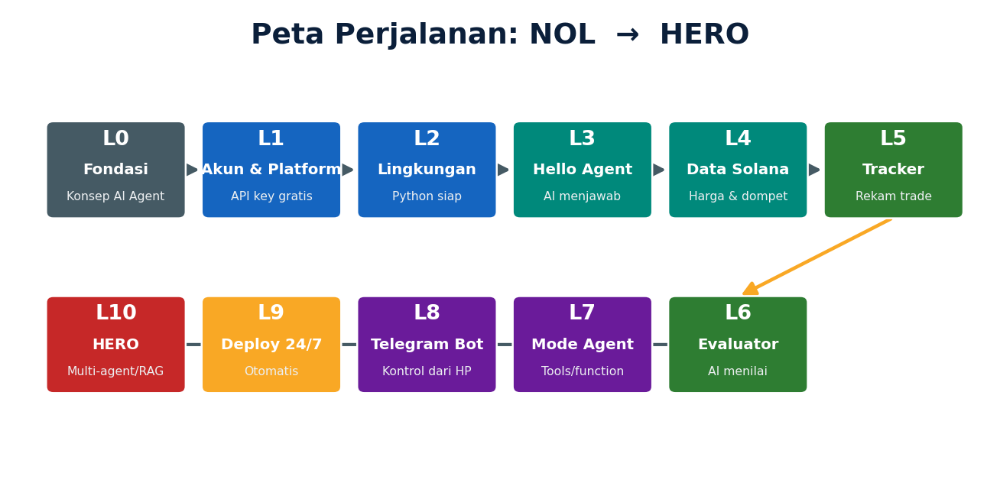
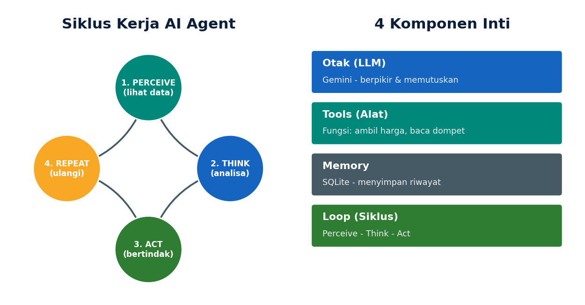
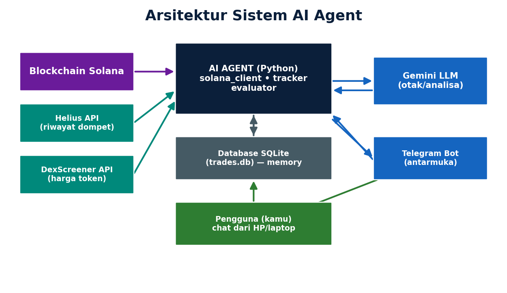
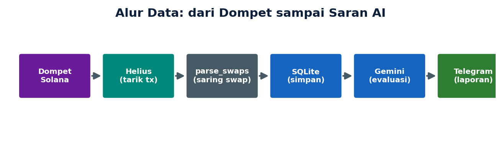
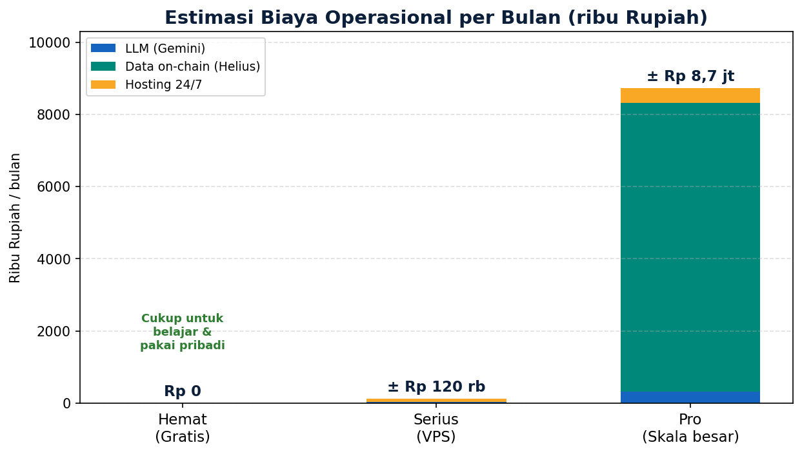

<div align="center">

# 🤖 BELAJAR AI AGENT DARI NOL SAMPAI MAHIR

## Proyek Nyata: AI Agent Pelacak & Evaluator Trading Crypto di Jaringan Solana

### Panduan Lengkap Berbahasa Indonesia — Lengkap dengan Kode, Gambar & Rincian Biaya

---

**Disusun untuk:** Pemula yang ingin menguasai AI Agent sekaligus punya alat bantu trading
**Fokus proyek:** Melacak (tracking) dan mengevaluasi transaksi trading crypto di chain Solana
**Bahasa pemrograman:** Python (paling ramah pemula)
**Level:** Zero → Hero (10 level bertahap)

---

> ⚠️ **Disclaimer penting:** Tutorial ini bertujuan **edukasi teknologi (AI + pemrograman)**, BUKAN nasihat keuangan/investasi. Trading crypto sangat berisiko tinggi. AI Agent di sini membantu **mencatat & menganalisa** keputusan kamu — bukan menjamin profit. Selalu lakukan riset mandiri (DYOR) dan jangan pernah membagikan *private key* / *seed phrase* kepada siapa pun, termasuk ke kode AI.

</div>

---

## 📋 DAFTAR ISI

1. [Cara Memakai Tutorial Ini](#1-cara-memakai-tutorial-ini)
2. [Peta Perjalanan (Roadmap Zero → Hero)](#2-peta-perjalanan-roadmap-zero--hero)
3. [Level 0 — Fondasi: Apa Itu AI Agent?](#3-level-0--fondasi-apa-itu-ai-agent)
4. [Level 1 — Menyiapkan Akun & Platform (Bisa Diakses dari Indonesia)](#4-level-1--menyiapkan-akun--platform-bisa-diakses-dari-indonesia)
5. [Level 2 — Menyiapkan Lingkungan Kerja](#5-level-2--menyiapkan-lingkungan-kerja)
6. [Level 3 — AI Agent Pertamamu (Hello Agent)](#6-level-3--ai-agent-pertamamu-hello-agent)
7. [Level 4 — Menyentuh Data Solana](#7-level-4--menyentuh-data-solana)
8. [Level 5 — Membangun Tracker (Pelacak Trade)](#8-level-5--membangun-tracker-pelacak-trade)
9. [Level 6 — Membangun Evaluator (AI Menilai Trade)](#9-level-6--membangun-evaluator-ai-menilai-trade)
10. [Level 7 — Mode Agent: Tools & Function Calling](#10-level-7--mode-agent-tools--function-calling)
11. [Level 8 — Antarmuka Telegram Bot](#11-level-8--antarmuka-telegram-bot)
12. [Level 9 — Deploy & Otomatisasi 24/7](#12-level-9--deploy--otomatisasi-247)
13. [Level 10 — Naik Kelas Jadi "Hero"](#13-level-10--naik-kelas-jadi-hero)
14. [Rincian Biaya Lengkap (Rupiah)](#14-rincian-biaya-lengkap-rupiah)
15. [Keamanan, Etika & Hukum di Indonesia](#15-keamanan-etika--hukum-di-indonesia)
16. [Rencana Belajar 4 Minggu](#16-rencana-belajar-4-minggu)
17. [Troubleshooting & FAQ](#17-troubleshooting--faq)
18. [Sumber Belajar Lanjutan](#18-sumber-belajar-lanjutan)

---

## 1. CARA MEMAKAI TUTORIAL INI

Tutorial ini dirancang **bertahap**. Setiap "Level" membangun di atas level sebelumnya. Ikuti urutannya, jangan loncat.

| Simbol | Arti |
|---|---|
| 🎯 | Tujuan level (apa yang akan kamu kuasai) |
| 🧩 | Konsep penting yang harus dipahami |
| 💻 | Langkah praktik (ada kode untuk diketik/dijalankan) |
| 💰 | Catatan biaya |
| ✅ | Checklist "lulus level" |
| ⚠️ | Peringatan penting |

**Yang kamu butuhkan untuk mulai:**
- Laptop/PC (Windows, Mac, atau Linux) — RAM 4GB sudah cukup.
- Koneksi internet.
- Kemauan belajar ~1 jam/hari selama 4 minggu.
- **Modal uang: Rp 0** untuk belajar (semua tool punya paket gratis). Modal trading terpisah dan opsional.

> 💡 Semua kode lengkap proyek ini sudah tersedia di folder `src/`. Tutorial menjelaskan **mengapa** dan **bagaimana** setiap bagian dibuat, supaya kamu paham, bukan sekadar copy-paste.

---

## 2. PETA PERJALANAN (ROADMAP ZERO → HERO)



Kita akan menempuh 10 level. Berikut gambaran besarnya:

| Level | Nama | Hasil yang didapat |
|---|---|---|
| 0 | Fondasi | Paham apa itu AI Agent, LLM, prompt, tools, memory |
| 1 | Akun & Platform | Punya semua API key gratis yang dibutuhkan |
| 2 | Lingkungan Kerja | Python siap, project bisa dijalankan |
| 3 | Hello Agent | AI Agent pertama menjawab pertanyaan |
| 4 | Data Solana | Bisa mengambil harga token & riwayat dompet |
| 5 | Tracker | Otomatis mencatat semua trade ke database |
| 6 | Evaluator | AI memberi skor & saran atas trading-mu |
| 7 | Mode Agent | AI bisa memanggil "tools" sendiri (function calling) |
| 8 | Telegram Bot | Kontrol agent dari HP lewat chat |
| 9 | Deploy 24/7 | Agent jalan sendiri tanpa laptop menyala |
| 10 | Hero | Multi-agent, RAG, backtest, no-code (n8n/Dify) |

---

## 3. LEVEL 0 — FONDASI: APA ITU AI AGENT?

🎯 **Tujuan:** Memahami konsep dasar sebelum menulis kode.

### 🧩 Definisi sederhana

**AI Agent** adalah program yang menggunakan model bahasa (LLM seperti Gemini/GPT) sebagai "otak" untuk **mengambil keputusan** dan **bertindak** dengan memakai *tools* (alat), bukan sekadar menjawab teks.

Bedanya dengan chatbot biasa:

| Chatbot biasa | AI Agent |
|---|---|
| Hanya membalas teks | Bisa **bertindak** (memanggil API, baca database, kirim notifikasi) |
| Tidak ingat konteks lama | Punya **memory** (ingatan) |
| Satu langkah | Bisa **multi-langkah** (rencana → aksi → cek hasil → ulangi) |
| Tidak punya alat | Punya **tools** (fungsi yang bisa dipanggil) |

### 🧩 4 Komponen Inti AI Agent



1. **Otak (LLM)** — model seperti `Gemini 2.5 Flash`. Bertugas berpikir & memutuskan.
2. **Tools (Alat)** — fungsi yang bisa dipanggil otak, misal "ambil harga token", "baca riwayat dompet".
3. **Memory (Ingatan)** — menyimpan data/konteks, di proyek kita pakai database SQLite.
4. **Loop (Siklus)** — *Perceive (lihat data) → Think (analisa) → Act (bertindak) → Repeat*.

### 🧩 Istilah yang wajib kamu kenal

| Istilah | Arti singkat |
|---|---|
| **LLM** | *Large Language Model*, otak AI (Gemini, GPT, Claude) |
| **Prompt** | Instruksi/teks yang kita kirim ke LLM |
| **System prompt** | Instruksi "kepribadian & tugas" agent yang menetap |
| **Token** | Potongan kata; biaya & batas LLM dihitung per token |
| **API key** | Kunci rahasia untuk mengakses layanan (jangan dibagikan) |
| **Function calling** | Kemampuan LLM memanggil fungsi/tool kita sendiri |
| **RAG** | *Retrieval-Augmented Generation*, AI menjawab berdasarkan dokumen kita |
| **RPC** | Pintu masuk untuk membaca data blockchain Solana |

✅ **Lulus Level 0** jika kamu bisa menjelaskan dengan kata-katamu sendiri: apa beda AI Agent vs chatbot, dan apa itu "tools".

---

## 4. LEVEL 1 — MENYIAPKAN AKUN & PLATFORM (BISA DIAKSES DARI INDONESIA)

🎯 **Tujuan:** Punya semua kunci (API key) gratis yang dibutuhkan proyek.

Semua platform di bawah ini **bisa diakses dari Indonesia** dan punya **paket gratis** yang cukup untuk belajar.

### 🛠️ A. Platform "Otak" AI (LLM)

| Platform | Akses dari Indonesia | Paket gratis | Catatan |
|---|---|---|---|
| **Google AI Studio (Gemini)** ⭐ | ✅ Ya, mudah (login Google) | ✅ Sangat murah hati | **Rekomendasi utama** untuk pemula |
| OpenAI (ChatGPT API) | ✅ Ya | ❌ Perlu top-up (mulai $5) | Butuh kartu kredit/debit internasional |
| Anthropic (Claude API) | ✅ Ya | Kredit awal terbatas | Bagus untuk teks panjang |
| Groq | ✅ Ya | ✅ Gratis, sangat cepat | Alternatif gratis selain Gemini |

> ⭐ **Kita pakai Gemini** karena: gratis, kualitas bagus, dan cuma butuh akun Google. Per awal 2026, paket gratis Gemini berpusat pada model 2.5. Contoh batas gratis: `Gemini 2.5 Flash` ±10 permintaan/menit & 250 permintaan/hari; `Gemini 2.5 Flash-Lite` ±15 permintaan/menit & 1.000 permintaan/hari. (Batas bisa berubah — cek dokumentasi resmi.) *Informasi dirangkum ulang untuk kepatuhan lisensi.*

**💻 Langkah ambil API key Gemini (GRATIS):**
1. Buka [https://aistudio.google.com/app/apikey](https://aistudio.google.com/app/apikey)
2. Login dengan akun Google.
3. Klik **"Create API key"** → salin kuncinya.
4. Simpan baik-baik (nanti ditaruh di file `.env`).

### 🛠️ B. Platform Data Solana (On-Chain)

| Platform | Fungsi | Paket gratis | API key? |
|---|---|---|---|
| **DexScreener** ⭐ | Harga & info token DEX | ✅ Gratis, ±300 req/menit | ❌ Tidak perlu |
| **Helius** ⭐ | Riwayat transaksi dompet (parsed) | ✅ 1 juta kredit/bln, ±100rb panggilan DAS/bln, 10 req/detik | ✅ Perlu (gratis) |
| Birdeye | Data harga/analitik token | Free tier terbatas | ✅ Perlu |
| Jupiter API | Agregator harga swap | ✅ Gratis | ❌/✅ |
| Solana RPC publik | Baca data chain mentah | ✅ Gratis (rate terbatas) | ❌ |

> ⭐ Kita pakai **DexScreener** (harga, tanpa key) + **Helius** (riwayat dompet). Keduanya cukup di paket gratis. *Batas paket dirangkum ulang dari dokumentasi resmi untuk kepatuhan lisensi.*

**💻 Langkah ambil API key Helius (GRATIS):**
1. Buka [https://dashboard.helius.dev](https://dashboard.helius.dev) → daftar (bisa pakai Google).
2. Pilih paket **Free**.
3. Salin **API Key** dari dashboard.

### 🛠️ C. Antarmuka: Telegram Bot (GRATIS)

**💻 Langkah buat bot Telegram:**
1. Di Telegram, cari **@BotFather**.
2. Ketik `/newbot` → ikuti instruksi (beri nama & username bot).
3. BotFather memberi **token** → salin (taruh di `.env`).

### 🛠️ D. Dompet & Bursa Solana di Indonesia (untuk konteks trading)

Agar bisa benar-benar trading di Solana, kamu perlu dompet dan cara beli SOL. Yang umum & legal di Indonesia (terdaftar Bappebti):

| Kebutuhan | Pilihan populer |
|---|---|
| **Dompet Solana** | Phantom, Solflare (gratis, non-custodial) |
| **Beli SOL (on-ramp) di Indonesia** | Indodax, Tokocrypto, Pintu, Reku (terdaftar Bappebti) |
| **DEX di Solana** | Jupiter, Raydium (untuk swap token) |

> ⚠️ Untuk tutorial AI Agent, kamu **tidak wajib** punya modal. Kita bisa memantau **alamat dompet publik mana pun** (alamat saja, bukan private key) untuk belajar. Gunakan alamat dompetmu sendiri saat sudah siap.

✅ **Lulus Level 1** jika kamu sudah punya: (1) API key Gemini, (2) API key Helius, (3) token Bot Telegram, (4) satu alamat dompet Solana untuk dipantau.

---

## 5. LEVEL 2 — MENYIAPKAN LINGKUNGAN KERJA

🎯 **Tujuan:** Python siap dan proyek bisa dijalankan.

### Pilihan tempat ngoding (pilih salah satu)

| Opsi | Cocok untuk | Biaya | Catatan |
|---|---|---|---|
| **Google Colab** ⭐ | Pemula, tanpa instal apa pun | Gratis | Jalan di browser, ada GPU gratis |
| **VS Code + Python** ⭐ | Yang mau serius | Gratis | Editor terbaik di laptop sendiri |
| **Replit** | Coding online + hosting | Gratis/berbayar | Mudah deploy |

### 💻 Cara cepat (di laptop, pakai VS Code)

```bash
# 1. Pastikan Python 3.10+ terpasang
python --version

# 2. Clone repo proyek ini (ganti URL sesuai repo kamu)
git clone https://github.com/andizulham/Temporary.git
cd Temporary/ai-agent-solana-tutorial

# 3. Buat virtual environment (ruang terisolasi)
python -m venv venv
# Windows:
venv\Scripts\activate
# Mac/Linux:
source venv/bin/activate

# 4. Install semua dependensi
pip install -r requirements.txt

# 5. Siapkan file konfigurasi
cp .env.example .env       # Windows: copy .env.example .env
# lalu buka .env dan isi semua API key kamu
```

### 💻 Isi file `.env`

```ini
GEMINI_API_KEY=isi_dengan_key_gemini
GEMINI_MODEL=gemini-2.5-flash
HELIUS_API_KEY=isi_dengan_key_helius
TELEGRAM_BOT_TOKEN=isi_dengan_token_bot
WALLET_ADDRESS=alamat_dompet_solana_yang_dipantau
USD_TO_IDR=16300
```

> ⚠️ File `.env` berisi rahasia. Sudah otomatis di-*ignore* git (lihat `.gitignore`) supaya tidak ikut ter-*upload* ke GitHub.

✅ **Lulus Level 2** jika perintah `pip install -r requirements.txt` berhasil tanpa error dan file `.env` sudah terisi.

---

## 6. LEVEL 3 — AI AGENT PERTAMAMU (HELLO AGENT)

🎯 **Tujuan:** Membuktikan "otak" AI bekerja.

### 🧩 Konsep

Kita kirim *system prompt* (kepribadian + tugas) lalu sebuah pertanyaan. LLM membalas. Inilah inti dari semua agent.

### 💻 Kode minimal (uji coba Gemini)

Buat file `hello_agent.py` lalu jalankan:

```python
import google.generativeai as genai
from config import settings

genai.configure(api_key=settings.GEMINI_API_KEY)

model = genai.GenerativeModel(
    settings.GEMINI_MODEL,
    system_instruction="Kamu asisten trading Solana yang ramah dan jujur."
)

resp = model.generate_content("Jelaskan apa itu 'slippage' saat swap token Solana, singkat.")
print(resp.text)
```

Jika muncul jawaban berbahasa Indonesia tentang slippage — **selamat, otak agent-mu hidup!** 🎉

### 🧩 Anatomi yang baru saja kamu pakai
- `system_instruction` → menetapkan peran agent.
- `generate_content(...)` → mengirim prompt & menerima jawaban.
- `resp.text` → teks hasil.

✅ **Lulus Level 3** jika kamu berhasil mendapat balasan dari Gemini.

---

## 7. LEVEL 4 — MENYENTUH DATA SOLANA

🎯 **Tujuan:** Agent bisa "melihat" dunia nyata: harga token & riwayat dompet.

### 🧩 Arsitektur sumber data



Kita memakai dua "mata":
- **DexScreener** → harga & likuiditas token (tanpa API key).
- **Helius** → riwayat transaksi dompet (butuh API key gratis).

Semua ini sudah dibungkus rapi di `src/solana_client.py`. Contoh bagian inti:

```python
def get_token_price(mint_address: str) -> dict:
    url = f"https://api.dexscreener.com/tokens/v1/solana/{mint_address}"
    data = _get(url)
    # ... pilih pair dengan likuiditas terbesar, ambil harga USD ...
    return {"symbol": ..., "price_usd": ..., "liquidity_usd": ...}
```

### 💻 Coba ambil harga SOL

```bash
python src/solana_client.py
```

Output kira-kira:
```
Harga SOL  : $ 168.42
Info USDC  : {'symbol': 'USDC', 'price_usd': 1.0, ...}
```

### 🧩 Mengapa pakai `mint address`?
Setiap token Solana punya alamat unik (*mint*). Contoh:
- SOL: `So11111111111111111111111111111111111111112`
- USDC: `EPjFWdd5AufqSSqeM2qN1xzybapC8G4wEGGkZwyTDt1v`

✅ **Lulus Level 4** jika kamu berhasil menampilkan harga sebuah token.

---

## 8. LEVEL 5 — MEMBANGUN TRACKER (PELACAK TRADE)

🎯 **Tujuan:** Otomatis menarik transaksi dompet dan menyimpannya ke database.

### 🧩 Alur data



1. Helius memberi daftar transaksi mentah dompet.
2. Fungsi `parse_swaps()` menyaring yang berupa **swap** (beli/jual).
3. Disimpan ke **SQLite** (`trades.db`) supaya tidak hilang & bisa dianalisa.

Logika ini ada di `src/tracker.py`. Inti penyimpanannya:

```python
def sync_wallet(wallet=None, limit=30) -> int:
    txs = get_wallet_transactions(wallet, limit=limit)   # dari Helius
    swaps = parse_swaps(txs, wallet)                      # saring swap
    # ... simpan ke SQLite dengan INSERT OR IGNORE (anti duplikat) ...
    return jumlah_trade_baru
```

### 💻 Jalankan tracker

```bash
python src/main.py sync        # tarik & simpan transaksi terbaru
python src/main.py ringkasan   # lihat statistik
```

Contoh output:
```
✅ 7 trade baru tersimpan.
📊 Ringkasan Trade
   Total trade  : 7
   Trade pertama: 2026-05-20 03:11
   Trade terakhir: 2026-05-31 09:42
```

### 🧩 Kenapa SQLite?
Gratis, bawaan Python, tidak perlu server. Cocok untuk proyek pribadi. Nanti di Level 10 bisa diganti PostgreSQL kalau perlu.

✅ **Lulus Level 5** jika trade dari sebuah dompet berhasil tersimpan di `trades.db`.

---

## 9. LEVEL 6 — MEMBANGUN EVALUATOR (AI MENILAI TRADE)

🎯 **Tujuan:** AI membaca riwayat trade-mu lalu memberi **skor** dan **saran**.

### 🧩 Konsep

Kita gabungkan: **data trade (dari tracker)** + **harga terkini (dari DexScreener)** → kirim ke Gemini dengan *system prompt* sebagai "pelatih trading". Gemini balas dengan analisa.

Logika di `src/evaluator.py`:

```python
SYSTEM_PROMPT = """Kamu "SolanaTradeCoach"... beri skor 1-10 untuk
Disiplin & Manajemen Risiko, plus 3 saran perbaikan. Selalu ingatkan DYOR."""

def evaluate_trades(limit=15) -> str:
    trades = get_recent_trades(limit)        # dari database
    konteks = format(trades, harga_sol, ...) # rangkai jadi teks
    model = genai.GenerativeModel(MODEL, system_instruction=SYSTEM_PROMPT)
    return model.generate_content("Evaluasi trading saya:\n" + konteks).text
```

### 💻 Minta evaluasi

```bash
python src/main.py evaluasi
```

Contoh hasil (ilustrasi):
```
📊 Evaluasi Trading Solana Kamu

Skor Disiplin: 6/10
Skor Manajemen Risiko: 4/10

Pola yang terlihat:
- Kamu cenderung membeli token saat sudah naik tajam (indikasi FOMO).
- Ukuran posisi tidak konsisten.

3 Saran perbaikan:
1. Tetapkan batas rugi (stop-loss) maksimal 10% per posisi.
2. Catat alasan setiap entry sebelum membeli.
3. Hindari membeli dalam 1 jam pertama token baru launching.

⚠️ Ini bukan nasihat keuangan. Selalu DYOR.
```

✅ **Lulus Level 6** jika AI memberi evaluasi atas data trade-mu.

---

## 10. LEVEL 7 — MODE AGENT: TOOLS & FUNCTION CALLING

🎯 **Tujuan:** Naik dari "AI yang menjawab" menjadi "AI yang bertindak".

### 🧩 Konsep terpenting di seluruh tutorial

Di Level 6, **kita** yang menyiapkan semua data lebih dulu. Di Level 7, **AI sendiri** yang memutuskan kapan butuh data dan **memanggil fungsi (tool)** kita. Inilah definisi sejati "AI Agent".


Di `src/evaluator.py`, kita daftarkan fungsi `get_token_price` sebagai tool:

```python
model = genai.GenerativeModel(
    settings.GEMINI_MODEL,
    system_instruction=SYSTEM_PROMPT,
    tools=[_tool_get_token_price],          # <-- tool didaftarkan
)
chat = model.start_chat(enable_automatic_function_calling=True)
resp = chat.send_message("Apakah token X masih layak hold di harga sekarang?")
```

Saat ditanya soal harga, Gemini akan **otomatis memanggil** `get_token_price()`, menerima hasilnya, lalu menjawab berdasarkan data nyata.

### 💻 Coba mode agent

```bash
python src/main.py tanya "Apakah saya terlalu sering FOMO minggu ini?"
python src/main.py tanya "Berapa harga SOL sekarang dan apakah portfolio saya membaik?"
```

✅ **Lulus Level 7** jika agent berhasil memanggil tool sendiri untuk menjawab pertanyaan harga.

---

## 11. LEVEL 8 — ANTARMUKA TELEGRAM BOT

🎯 **Tujuan:** Mengontrol agent dari HP lewat chat, kapan saja.

### 🧩 Konsep
Telegram menjadi "wajah" agent. Perintah `/sync`, `/ringkasan`, `/evaluasi`, atau teks bebas diteruskan ke logika yang sudah kita bangun di Level 5–7.

Kode ada di `src/telegram_bot.py`. Daftar perintah:

| Perintah | Fungsi |
|---|---|
| `/start` | Sapaan & bantuan |
| `/sync` | Tarik transaksi terbaru dompet |
| `/ringkasan` | Statistik trade |
| `/evaluasi` | AI menilai trading kamu |
| (teks bebas) | Tanya apa saja → mode agent |

### 💻 Jalankan bot

```bash
python src/telegram_bot.py
```

Lalu buka botmu di Telegram, ketik `/start`. Sekarang kamu punya **asisten trading di saku**. 📱

✅ **Lulus Level 8** jika bot membalas perintahmu di Telegram.

---

## 12. LEVEL 9 — DEPLOY & OTOMATISASI 24/7

🎯 **Tujuan:** Agent tetap hidup meski laptop dimatikan.

### Pilihan hosting (dari gratis sampai murah)

| Opsi | Biaya/bulan | Cocok untuk | Catatan |
|---|---|---|---|
| Laptop sendiri | Rp 0 | Belajar | Harus selalu menyala |
| **Railway / Render (free tier)** | Rp 0 – ±Rp 120rb | Bot kecil | Mudah, ada batas jam gratis |
| **VPS (Contabo, Biznet, Idcloudhost)** | ±Rp 50rb – Rp 150rb | Serius/24-7 | Kontrol penuh, perlu sedikit Linux |
| **Google Cloud / AWS free tier** | Rp 0 (1 tahun) | Belajar cloud | Perlu kartu kredit |

### 🧩 Otomatisasi terjadwal (cron)
Supaya `/sync` jalan otomatis tiap 30 menit, di VPS Linux tambahkan cron:

```bash
*/30 * * * * cd /path/ke/proyek && /path/venv/bin/python src/main.py sync
```

### 🧩 Alternatif tanpa coding: n8n
Kamu juga bisa menjadwalkan & merangkai alur pakai **n8n** (lihat Level 10) — cocok bila ingin minim kode.

✅ **Lulus Level 9** jika bot tetap merespons saat laptop kamu matikan.

---

## 13. LEVEL 10 — NAIK KELAS JADI "HERO"

🎯 **Tujuan:** Mengenal teknik & platform tingkat lanjut.

### 🚀 A. Platform No-Code / Low-Code AI Agent (populer & bisa diakses dari Indonesia)

| Platform | Jenis | Biaya | Kegunaan untuk proyek ini |
|---|---|---|---|
| **n8n** ⭐ | Otomatisasi workflow | Gratis (self-host) / berbayar cloud | Jadwalkan sync, sambungkan Telegram + API tanpa banyak kode |
| **Dify** ⭐ | AI app/agent builder | Gratis (self-host) / cloud | Bikin agent + RAG lewat antarmuka visual |
| **Flowise** | LLM flow builder | Gratis (open-source) | Rangkai chain/agent secara drag-and-drop |
| **Make.com / Zapier** | Otomatisasi | Free tier | Hubungkan notifikasi & spreadsheet |
| **Langflow** | Visual LangChain | Gratis | Prototipe cepat alur agent |

### 🚀 B. Teknik tingkat lanjut

1. **RAG (Retrieval-Augmented Generation)** — beri agent "buku catatan strategimu" supaya sarannya sesuai gaya tradingmu.
2. **Multi-agent** — pisahkan peran: satu agent "pelacak", satu "analis risiko", satu "pelapor".
3. **Backtesting** — uji strategi memakai data harga historis sebelum dipakai sungguhan.
4. **Notifikasi pintar** — alert otomatis saat ada transaksi besar / token mencurigakan (deteksi *rug pull*).
5. **Vector DB** (mis. Chroma/Qdrant) — untuk memory jangka panjang.

### 🚀 C. Framework Python lanjutan
- **LangChain / LangGraph** — kerangka kerja agent yang kuat.
- **CrewAI** — orkestrasi banyak agent dengan peran berbeda.

✅ **Lulus Level 10 (Hero)** jika kamu bisa menambah minimal satu fitur lanjutan (mis. notifikasi transaksi besar via Telegram).

---

## 14. RINCIAN BIAYA LENGKAP (RUPIAH)

> 💱 Asumsi kurs: **1 USD ≈ Rp 16.300** (estimasi 2026 — sesuaikan dengan kurs saat kamu membaca). Angka di bawah adalah **estimasi** dan dapat berubah sewaktu-waktu.

### 💰 A. Biaya Belajar (Skenario "Pelajar Hemat")

| Komponen | Pilihan gratis | Biaya |
|---|---|---|
| Materi belajar | Tutorial ini + dokumentasi resmi | **Rp 0** |
| LLM (otak AI) | Gemini free tier | **Rp 0** |
| Data Solana | DexScreener + Helius free | **Rp 0** |
| Antarmuka | Telegram Bot | **Rp 0** |
| Tempat ngoding | Google Colab / VS Code | **Rp 0** |
| Hosting belajar | Laptop sendiri | **Rp 0** |
| **TOTAL BELAJAR** | | **Rp 0** |

> ✅ Kamu **benar-benar bisa belajar dari nol sampai Level 8 tanpa mengeluarkan uang sama sekali.**

### 💰 B. Biaya Operasional Bulanan (3 Skenario)



| Komponen | 🟢 Hemat (Gratis) | 🟡 Serius | 🔴 Pro |
|---|---|---|---|
| LLM (Gemini) | Free tier — Rp 0 | Free/secukupnya — Rp 0–80rb | API berbayar — Rp 150rb–500rb |
| Data on-chain (Helius) | Free 1jt kredit — Rp 0 | Developer ±$49 → ±Rp 800rb | Business ±$499 → ±Rp 8jt |
| Data harga (DexScreener) | Gratis — Rp 0 | Gratis — Rp 0 | Plan berbayar (opsional) |
| Hosting 24/7 | Laptop — Rp 0 | VPS murah — ±Rp 80rb | VPS/Cloud — Rp 150rb–500rb |
| Notifikasi (Telegram) | Gratis — Rp 0 | Gratis — Rp 0 | Gratis — Rp 0 |
| **TOTAL/BULAN** | **Rp 0** | **±Rp 80rb – Rp 900rb** | **±Rp 8jt+** |

> 💡 **Untuk pemakaian pribadi**, skenario **Hemat (Rp 0)** atau **Serius (±Rp 80rb/bulan untuk VPS saja, sisanya tetap gratis)** sudah lebih dari cukup. Paket Pro hanya perlu jika kamu memantau banyak dompet/volume sangat tinggi.

### 💰 C. Biaya Sekali Bayar (Opsional)

| Item | Estimasi | Catatan |
|---|---|---|
| Domain (untuk dashboard web) | ±Rp 150rb/tahun | Opsional |
| Kursus berbayar (Udemy, dll) | ±Rp 150rb–500rb | Opsional, sering ada diskon |
| Kartu kredit virtual (untuk API luar) | ±Rp 0–50rb | Bila pakai OpenAI/cloud berbayar |

### 💰 D. Modal Trading (TERPISAH dari biaya belajar)

> ⚠️ Ini **bukan** biaya tutorial. Trading crypto berisiko kehilangan **seluruh** modal. Mulai dari jumlah **sangat kecil** yang kamu siap kehilangan (misal Rp 100rb–500rb) hanya untuk memahami mekanisme, bukan untuk cari untung cepat. **Bukan nasihat keuangan.**

### 📊 Kesimpulan biaya
- **Belajar AI Agent dari nol: Rp 0.**
- **Operasional pribadi nyaman: Rp 0 – ±Rp 80rb/bulan** (kalau mau VPS biar 24 jam).
- Biaya naik hanya jika skala besar (banyak dompet, volume tinggi, butuh data premium).

---

## 15. KEAMANAN, ETIKA & HUKUM DI INDONESIA

| Aturan | Penjelasan |
|---|---|
| 🔐 **Jangan pernah** masukkan *private key*/*seed phrase* ke kode/AI | Cukup pakai **alamat publik** untuk memantau. Private key = akses penuh ke danamu |
| 🗝️ Simpan API key di `.env` | Jangan hard-code di kode, jangan commit ke GitHub |
| 🧾 Patuhi aturan Bappebti | Gunakan bursa terdaftar (Indodax, Tokocrypto, Pintu, Reku) |
| 💸 Pajak | Transaksi crypto di Indonesia dikenakan pajak — catat transaksimu |
| 🤖 AI = alat bantu, bukan peramal | Output AI bisa salah. Selalu verifikasi & DYOR |
| ⚖️ Bukan nasihat keuangan | Tutorial ini edukasi teknologi, bukan ajakan investasi |

---

## 16. RENCANA BELAJAR 4 MINGGU

| Minggu | Fokus | Target |
|---|---|---|
| **Minggu 1** | Level 0–2 | Paham konsep, semua akun & lingkungan siap |
| **Minggu 2** | Level 3–5 | Hello Agent jalan, data Solana masuk, tracker menyimpan trade |
| **Minggu 3** | Level 6–8 | Evaluator + mode agent + bot Telegram aktif |
| **Minggu 4** | Level 9–10 | Deploy 24/7 + tambah 1 fitur Hero (notifikasi/RAG) |

> ⏱️ Estimasi waktu: ±1 jam/hari. Lebih baik konsisten sedikit setiap hari daripada maraton sesekali.

---

## 17. TROUBLESHOOTING & FAQ

**❓ `GEMINI_API_KEY belum diisi`**
→ Pastikan file bernama persis `.env` (bukan `.env.txt`) dan berada di folder proyek.

**❓ Error `429 Too Many Requests`**
→ Kamu kena batas rate gratis. Tunggu sebentar, atau kurangi frekuensi. Kode sudah punya *retry* otomatis.

**❓ Helius mengembalikan kosong**
→ Cek alamat dompet benar, dan dompet memang punya transaksi. Coba `limit` lebih besar.

**❓ Bot Telegram tidak membalas**
→ Pastikan `python src/telegram_bot.py` masih berjalan dan token benar.

**❓ Apakah harus bisa coding dulu?**
→ Tidak harus mahir. Tutorial ini ramah pemula. Untuk jalur tanpa-kode, lihat n8n/Dify di Level 10.

**❓ Apakah benar-benar gratis?**
→ Ya, untuk belajar sampai Level 8. Biaya muncul hanya jika ingin 24/7 (VPS) atau skala besar.

---

## 18. SUMBER BELAJAR LANJUTAN

- 📘 Dokumentasi resmi Gemini API: [ai.google.dev/gemini-api/docs](https://ai.google.dev/gemini-api/docs)
- 📘 Dokumentasi Helius: [helius.dev/docs](https://www.helius.dev/docs)
- 📘 Dokumentasi DexScreener API: [docs.dexscreener.com/api](https://docs.dexscreener.com/api)
- 📘 python-telegram-bot: [docs.python-telegram-bot.org](https://docs.python-telegram-bot.org)
- 📘 n8n: [docs.n8n.io](https://docs.n8n.io) · Dify: [docs.dify.ai](https://docs.dify.ai) · Flowise: [docs.flowiseai.com](https://docs.flowiseai.com)
- 📘 Solana Cookbook: [solana.com/developers](https://solana.com/developers)

---

<div align="center">

### 🎓 Selamat! Dari NOL, kamu kini punya peta lengkap menjadi HERO AI Agent.

**Mulai dari Level 0, kerjakan satu per satu, dan rayakan tiap "✅ Lulus Level".**

*Ingat: AI Agent ini teman analisamu, keputusan tetap di tanganmu. DYOR & trading dengan bijak.*

</div>
