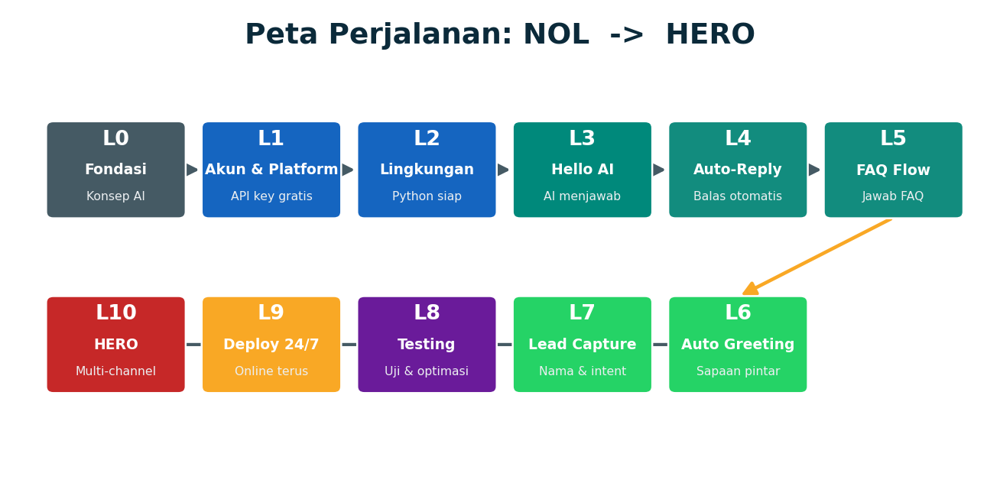
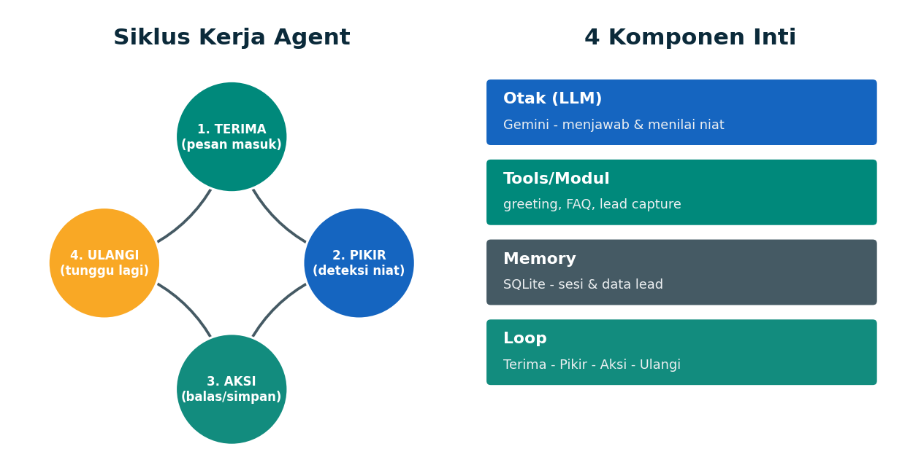
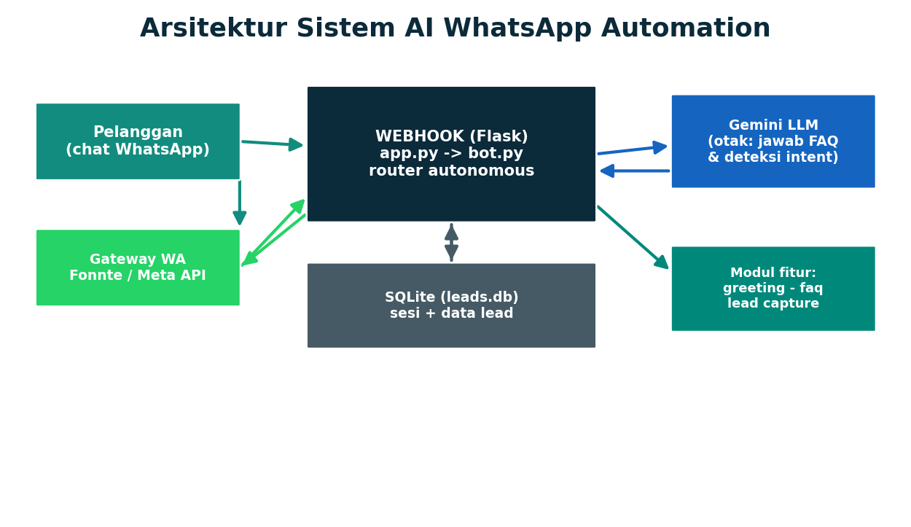
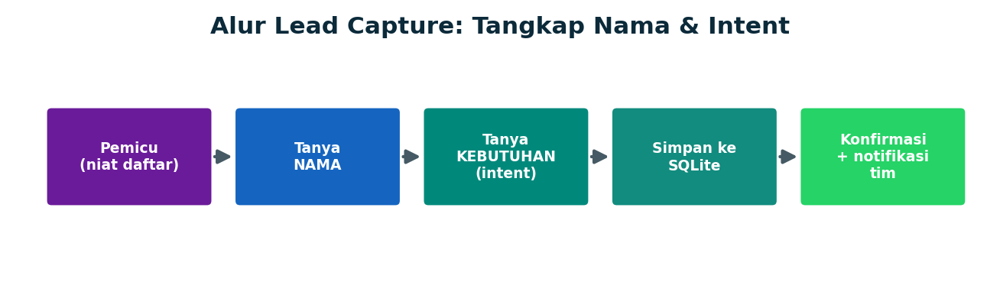
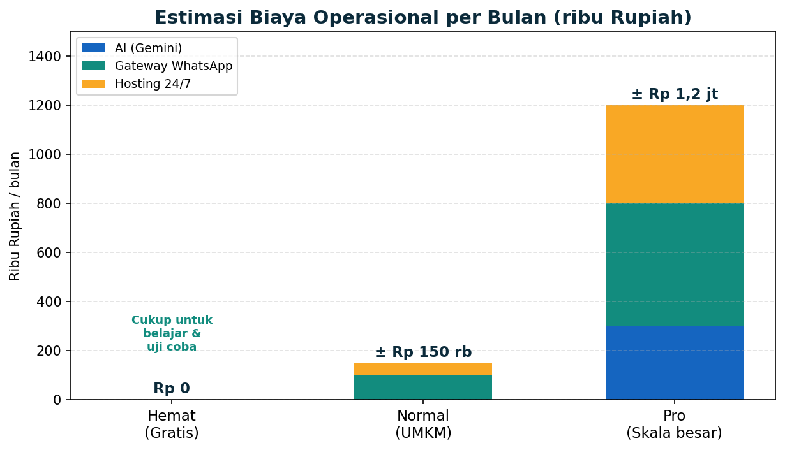

<div align="center">

# 🤖 BELAJAR AI AUTONOMOUS WHATSAPP DARI NOL SAMPAI MAHIR

## Proyek Nyata: Bot WhatsApp Otomatis (Auto-Reply, FAQ, Greeting, Lead Capture)

### Panduan Lengkap Berbahasa Indonesia — Lengkap dengan Kode, Gambar & Rincian Biaya (Rupiah)

---

**Disusun untuk:** Pemula yang ingin membuat asisten WhatsApp otomatis bertenaga AI untuk bisnis/UMKM
**Fokus proyek:** Balas pesan otomatis 24 jam, jawab FAQ, sapa pelanggan, dan tangkap data calon pembeli (lead)
**Bahasa pemrograman:** Python (paling ramah pemula)
**Platform:** Semua bisa diakses & legal dari Indonesia, punya paket gratis
**Level:** Zero → Hero (11 level bertahap)

---

> ⚠️ **Catatan penting:** Tutorial ini untuk **edukasi teknologi (AI + otomatisasi bisnis)**. Patuhi selalu Kebijakan WhatsApp Business: jangan pakai untuk spam, jangan kirim pesan massal tanpa izin (opt-in), dan lindungi data pribadi pelanggan sesuai UU PDP (Pelindungan Data Pribadi). Bot di sini membantu **melayani** pelanggan, bukan mengganggu mereka.

</div>

---

## 📋 DAFTAR ISI

1. [Cara Memakai Tutorial Ini](#1-cara-memakai-tutorial-ini)
2. [Peta Perjalanan (Roadmap Zero → Hero)](#2-peta-perjalanan-roadmap-zero--hero)
3. [Level 0 — Fondasi: Apa Itu AI Autonomous?](#3-level-0--fondasi-apa-itu-ai-autonomous)
4. [Level 1 — Menyiapkan Akun & Platform (Bisa Diakses dari Indonesia)](#4-level-1--menyiapkan-akun--platform-bisa-diakses-dari-indonesia)
5. [Level 2 — Menyiapkan Lingkungan Kerja](#5-level-2--menyiapkan-lingkungan-kerja)
6. [Level 3 — Otak AI Pertamamu (Hello AI)](#6-level-3--otak-ai-pertamamu-hello-ai)
7. [Level 4 — Proyek 1: WhatsApp Auto-Reply](#7-level-4--proyek-1-whatsapp-auto-reply)
8. [Level 5 — Proyek 2: Alur Otomatisasi FAQ](#8-level-5--proyek-2-alur-otomatisasi-faq)
9. [Level 6 — Proyek 3: Pesan Sapaan Otomatis (Auto Greeting)](#9-level-6--proyek-3-pesan-sapaan-otomatis-auto-greeting)
10. [Level 7 — Proyek 4: Lead Capture (Nama & Intent)](#10-level-7--proyek-4-lead-capture-nama--intent)
11. [Level 8 — Proyek 5: Testing & Optimasi Dasar](#11-level-8--proyek-5-testing--optimasi-dasar)
12. [Level 9 — Deploy & Online 24/7](#12-level-9--deploy--online-247)
13. [Level 10 — Naik Kelas Jadi "Hero"](#13-level-10--naik-kelas-jadi-hero)
14. [Rincian Biaya Lengkap (Hemat & Normal)](#14-rincian-biaya-lengkap-hemat--normal)
15. [Keamanan, Etika & Aturan WhatsApp](#15-keamanan-etika--aturan-whatsapp)
16. [Rencana Belajar 4 Minggu](#16-rencana-belajar-4-minggu)
17. [Troubleshooting & FAQ](#17-troubleshooting--faq)
18. [Sumber Belajar Lanjutan](#18-sumber-belajar-lanjutan)

---

## 1. CARA MEMAKAI TUTORIAL INI

Tutorial ini dirancang **bertahap**. Setiap "Level" membangun di atas level sebelumnya. Ikuti urutannya, jangan loncat.

| Simbol | Arti |
|---|---|
| 🎯 | Tujuan level (apa yang akan kamu kuasai) |
| 🧩 | Konsep penting yang harus dipahami |
| 💻 | Langkah praktik (ada kode untuk diketik/dijalankan) |
| 💰 | Catatan biaya |
| ✅ | Checklist "lulus level" |
| ⚠️ | Peringatan penting |

**Yang kamu butuhkan untuk mulai:**
- Laptop/PC (Windows, Mac, atau Linux) — RAM 4GB sudah cukup.
- Koneksi internet.
- Satu nomor WhatsApp (boleh nomor kedua/khusus bisnis).
- Kemauan belajar ~1 jam/hari selama 4 minggu.
- **Modal uang: Rp 0** untuk belajar (semua tool punya paket gratis).

> 💡 Semua kode proyek ini sudah tersedia di folder `src/`. Yang spesial: bot ini **tetap jalan tanpa API key** (mode hemat berbasis aturan), sehingga kamu bisa belajar & menguji **100% gratis** sebelum menyambungkannya ke WhatsApp sungguhan.

**5 proyek nyata yang akan kamu bangun:**

| # | Proyek | Level |
|---|---|---|
| 1 | **WhatsApp Auto-Reply** (balas pesan otomatis 24 jam) | Level 4 |
| 2 | **Alur Otomatisasi FAQ** (jawab pertanyaan umum) | Level 5 |
| 3 | **Auto Greeting** (sapaan baru/kembali/di luar jam) | Level 6 |
| 4 | **Lead Capture** (tangkap nama & intent calon pembeli) | Level 7 |
| 5 | **Testing & Optimasi Dasar** (uji otomatis + penyempurnaan) | Level 8 |

---

## 2. PETA PERJALANAN (ROADMAP ZERO → HERO)



Kita akan menempuh 11 level. Berikut gambaran besarnya:

| Level | Nama | Hasil yang didapat |
|---|---|---|
| 0 | Fondasi | Paham apa itu AI Autonomous, LLM, intent, webhook |
| 1 | Akun & Platform | Punya semua API key/token gratis yang dibutuhkan |
| 2 | Lingkungan Kerja | Python siap, project bisa dijalankan |
| 3 | Hello AI | Otak AI (Gemini) menjawab pertanyaan pertama |
| 4 | **Auto-Reply** | Bot membalas pesan WhatsApp otomatis |
| 5 | **FAQ Flow** | Bot menjawab pertanyaan umum dari "buku pengetahuan" |
| 6 | **Auto Greeting** | Bot menyapa otomatis (baru/kembali/di luar jam) |
| 7 | **Lead Capture** | Bot menangkap nama & kebutuhan calon pembeli |
| 8 | **Testing & Optimasi** | Uji otomatis + sempurnakan jawaban |
| 9 | Deploy 24/7 | Bot online sendiri tanpa laptop menyala |
| 10 | Hero | Multi-channel, CRM, follow-up, no-code (n8n/Dify) |

---

## 3. LEVEL 0 — FONDASI: APA ITU AI AUTONOMOUS?

🎯 **Tujuan:** Memahami konsep dasar sebelum menulis kode.

### 🧩 Definisi sederhana

**AI Autonomous** (agent otonom) adalah program yang menggunakan model bahasa (LLM seperti Gemini) sebagai "otak" untuk **memahami pesan**, **mengambil keputusan**, dan **bertindak sendiri** (membalas, menyimpan data, menyapa) — tanpa harus ditunggu manusia.

Bedanya dengan chatbot "tombol" biasa:

| Chatbot tombol biasa | AI Autonomous |
|---|---|
| Hanya mengikuti menu kaku (balas angka) | Memahami **bahasa natural** ("brp hrga nya kak?") |
| Tidak ingat percakapan | Punya **memory** (ingat sudah sampai mana) |
| Satu langkah | **Multi-langkah**: sapa → jawab → tangkap lead |
| Tidak bisa menilai maksud | Bisa **deteksi intent** (niat) pelanggan |

### 🧩 4 Komponen Inti



1. **Otak (LLM)** — model `Gemini 2.5 Flash`. Memahami pesan & menyusun jawaban.
2. **Tools/Modul** — fungsi yang dijalankan: kirim sapaan, cari FAQ, simpan lead.
3. **Memory (Ingatan)** — database SQLite menyimpan status percakapan & data lead.
4. **Loop (Siklus)** — *Terima pesan → Pikir (deteksi niat) → Aksi (balas/simpan) → Ulangi*.

### 🧩 Istilah yang wajib kamu kenal

| Istilah | Arti singkat |
|---|---|
| **LLM** | *Large Language Model*, otak AI (Gemini, GPT, dll) |
| **Intent** | Niat/maksud pesan pelanggan (tanya harga, mau beli, dll) |
| **Webhook** | "Pintu masuk": URL yang dipanggil saat ada pesan WhatsApp baru |
| **Gateway WA** | Jembatan teknis antara kode kamu dan WhatsApp (Fonnte/Meta) |
| **Lead** | Calon pelanggan beserta datanya (nama, kebutuhan) |
| **API key / token** | Kunci rahasia untuk mengakses layanan (jangan dibagikan) |
| **State / Session** | Status percakapan tiap nomor (mis. "sedang isi nama") |
| **Grounded** | AI menjawab **berdasarkan data kita** (FAQ), bukan mengarang |

✅ **Lulus Level 0** jika kamu bisa menjelaskan dengan kata-katamu sendiri: apa beda AI Autonomous vs chatbot tombol, dan apa itu "intent" & "webhook".

---

## 4. LEVEL 1 — MENYIAPKAN AKUN & PLATFORM (BISA DIAKSES DARI INDONESIA)

🎯 **Tujuan:** Punya semua kunci (API key/token) gratis yang dibutuhkan.

Semua platform di bawah ini **bisa diakses dari Indonesia** dan punya **paket gratis** yang cukup untuk belajar.

### 🛠️ A. Platform "Otak" AI (LLM)

| Platform | Akses dari Indonesia | Paket gratis | Catatan |
|---|---|---|---|
| **Google AI Studio (Gemini)** ⭐ | ✅ Ya, mudah (login Google) | ✅ Sangat murah hati | **Rekomendasi utama** untuk pemula |
| OpenAI (ChatGPT API) | ✅ Ya | ❌ Perlu top-up (mulai $5) | Butuh kartu kredit/debit internasional |
| Groq | ✅ Ya | ✅ Gratis, sangat cepat | Alternatif gratis selain Gemini |

> ⭐ **Kita pakai Gemini** karena gratis, kualitas bagus, dan cuma butuh akun Google. Per awal 2026 paket gratis berpusat pada model 2.5 (contoh batas: `Gemini 2.5 Flash` sekitar 10 permintaan/menit & 250/hari; `Flash-Lite` sekitar 15/menit & 1.000/hari). Batas bisa berubah — cek dokumentasi resmi. *Informasi dirangkum ulang untuk kepatuhan lisensi.*

**💻 Langkah ambil API key Gemini (GRATIS):**
1. Buka [https://aistudio.google.com/app/apikey](https://aistudio.google.com/app/apikey)
2. Login dengan akun Google.
3. Klik **"Create API key"** → salin kuncinya.
4. Simpan baik-baik (nanti ditaruh di file `.env`).

### 🛠️ B. Platform Gateway WhatsApp

Untuk menyambungkan kode ke WhatsApp, kamu butuh **gateway**. Ada 2 jalur populer & legal di Indonesia:

| Platform | Jenis | Akses Indonesia | Paket gratis/murah | Cocok untuk |
|---|---|---|---|---|
| **Fonnte** ⭐ | Gateway lokal Indonesia | ✅ Ya | Ada paket murah, mudah | Pemula, UMKM (paling cepat jadi) |
| **Meta WhatsApp Cloud API** ⭐ | Resmi dari Meta | ✅ Ya | ✅ Pesan layanan gratis | Yang mau resmi & skala besar |
| Wablas / Watzap.id | Gateway lokal | ✅ Ya | Berbayar (murah) | Alternatif lokal |
| Twilio | Gateway global | ✅ Ya | Trial terbatas | Developer berpengalaman |

> ⭐ **Tutorial ini mendukung KEDUANYA** (Fonnte & Meta). Kamu cukup mengubah satu baris di `.env` (`WHATSAPP_PROVIDER`). Untuk belajar, ada juga mode **`console`** yang tidak butuh akun apa pun — bot mencetak balasan ke layar.

**💡 Kabar baik soal biaya Meta:** Sejak akhir 2024, Meta menggratiskan *service conversation* (percakapan yang **dimulai oleh pelanggan**), dan sejak April 2025 template *utility* gratis dalam jendela 24 jam. Karena bot kita **membalas** pesan masuk pelanggan, sebagian besar interaksi masuk kategori **gratis**. Meta juga memberi sekitar **1.000 percakapan layanan gratis/bulan**. *(Dirangkum dari [pembaruan harga WhatsApp Business](https://developers.facebook.com/docs/whatsapp/pricing/updates-to-pricing/) & [ringkasan harga](https://chatmaxima.com/whatsapp-api-pricing/); dirangkum ulang untuk kepatuhan lisensi.)*

**💻 Langkah Fonnte (paling mudah):**
1. Daftar di situs Fonnte, login.
2. Tambah "Device" → scan QR dengan WhatsApp nomor bisnismu (seperti WhatsApp Web).
3. Salin **token** device → taruh di `.env` (`FONNTE_TOKEN`).
4. Atur **webhook** ke URL server kamu (lihat Level 4 & 9).

**💻 Langkah Meta Cloud API (resmi):**
1. Buat akun di Meta for Developers, buat App tipe **Business**.
2. Tambahkan produk **WhatsApp** → dapat nomor uji + **token** + **Phone Number ID**.
3. Isi `META_WA_TOKEN`, `META_WA_PHONE_NUMBER_ID`, dan tentukan `META_VERIFY_TOKEN` (bebas).
4. Daftarkan webhook (lihat Level 4 & 9).

### 🛠️ C. Tunnel untuk Testing Lokal (GRATIS)

Agar WhatsApp bisa "menemukan" laptop kamu saat testing, pakai tunnel:
- **ngrok** (gratis) — `ngrok http 5000`
- **cloudflared** (gratis) — `cloudflared tunnel --url http://localhost:5000`

✅ **Lulus Level 1** jika kamu sudah punya: (1) API key Gemini, dan (2) memilih salah satu jalur gateway (Fonnte / Meta), atau cukup pakai mode `console` dulu untuk belajar.

---

## 5. LEVEL 2 — MENYIAPKAN LINGKUNGAN KERJA

🎯 **Tujuan:** Python siap dan proyek bisa dijalankan.

### Pilihan tempat ngoding (pilih salah satu)

| Opsi | Cocok untuk | Biaya |
|---|---|---|
| **VS Code + Python** ⭐ | Yang mau serius | Gratis |
| **Google Colab** | Coba-coba cepat | Gratis |
| **Replit** | Coding online + hosting | Gratis/berbayar |

### 💻 Cara cepat (di laptop, pakai VS Code)

```bash
# 1. Pastikan Python 3.10+ terpasang
python --version

# 2. Clone repo proyek ini
git clone https://github.com/andizulham/Temporary.git
cd Temporary/ai-whatsapp-automation-tutorial

# 3. Buat virtual environment (ruang terisolasi)
python -m venv venv
# Windows:
venv\Scripts\activate
# Mac/Linux:
source venv/bin/activate

# 4. Install semua dependensi
pip install -r requirements.txt

# 5. Siapkan file konfigurasi
cp .env.example .env       # Windows: copy .env.example .env
# lalu buka .env dan isi (untuk awal, biarkan WHATSAPP_PROVIDER=console)
```

### 💻 Isi file `.env` (minimal untuk belajar)

```ini
# Untuk belajar 100% gratis, cukup ini saja:
WHATSAPP_PROVIDER=console
BUSINESS_NAME=Toko Maju Jaya
BUSINESS_HOURS=Senin-Jumat 09.00-18.00 WIB

# (Opsional) isi ini kalau mau jawaban AI lebih natural:
GEMINI_API_KEY=isi_dengan_key_gemini
GEMINI_MODEL=gemini-2.5-flash
```

> ⚠️ File `.env` berisi rahasia. Sudah otomatis di-*ignore* git (lihat `.gitignore`) supaya tidak ikut ter-*upload* ke GitHub.

✅ **Lulus Level 2** jika perintah `pip install -r requirements.txt` berhasil tanpa error.

---

## 6. LEVEL 3 — OTAK AI PERTAMAMU (HELLO AI)

🎯 **Tujuan:** Membuktikan "otak" AI bekerja (dan paham mode hemat tanpa AI).

### 🧩 Konsep

Otak AI kita ada di `src/ai_brain.py`. Ia punya dua tugas:
- `detect_intent(teks)` → menebak niat: `greeting`, `faq`, `lead`, atau `other`.
- `generate_reply(teks)` → menyusun balasan yang **grounded** ke FAQ bisnis.

Yang penting: jika `GEMINI_API_KEY` kosong, otak otomatis memakai **mode aturan (rule-based)** — tetap bisa menjawab FAQ. Ini membuat belajar & testing **gratis dan stabil**.

### 💻 Coba langsung

```bash
python src/ai_brain.py
```

Contoh output (mode tanpa AI):
```
AI aktif? False
[greeting] halo kak
-> Maaf, aku belum punya jawaban pasti... (menawarkan menu)
[faq     ] berapa harganya?
-> Berikut ringkasan paket kami: - Paket Hemat: Rp 500.000 ...
[lead    ] saya mau daftar
-> ...
```

Kalau kamu mengisi `GEMINI_API_KEY`, jawaban FAQ akan disusun lebih natural oleh Gemini, **tetapi tetap berdasarkan data di `data/faq.json`** (tidak mengarang).

### 🧩 Anatomi yang baru saja kamu pakai
- `system_instruction` → menetapkan peran: "Kamu CS otomatis untuk [Bisnis]".
- `DATA BISNIS` (dari `data/faq.json`) → disisipkan agar AI tidak mengarang.
- `detect_intent` → memetakan pesan ke salah satu niat.

✅ **Lulus Level 3** jika `python src/ai_brain.py` menampilkan jawaban (baik mode AI maupun mode aturan).

---

## 7. LEVEL 4 — PROYEK 1: WHATSAPP AUTO-REPLY

🎯 **Tujuan:** Bot membalas SETIAP pesan masuk secara otomatis, 24 jam.

### 🧩 Arsitektur



Alurnya:
```
Pelanggan → Gateway WA (Fonnte/Meta) → Webhook (Flask, app.py)
          → bot.handle_message() → balasan → kirim balik via gateway
```

File `src/app.py` adalah **server webhook**. Saat ada pesan masuk, ia memanggil `bot.handle_message(nomor, teks)` lalu mengirim balasannya.

### 🧩 Inti auto-reply (di `src/bot.py`)

```python
def handle_message(phone: str, text: str) -> list[str]:
    # 1. Sedang isi data lead?  -> lanjutkan
    # 2. Kontak baru?           -> sapa (auto greeting)
    # 3. Niat mendaftar?        -> mulai lead capture
    # 4. Cocok FAQ/pertanyaan?  -> jawab via AI (grounded)
    # 5. Lainnya                -> jawaban umum
    ...
    return replies   # daftar 1-2 pesan balasan
```

### 💻 Coba tanpa WhatsApp dulu (gratis)

```bash
python src/simulator.py            # mode chat interaktif
# atau
python src/simulator.py demo       # skenario otomatis
```

Ketik apa saja seperti pelanggan; bot langsung membalas. **Inilah inti auto-reply** — logika yang sama nanti dipakai saat tersambung ke WhatsApp asli.

### 💻 Menjalankan server webhook (saat siap ke WhatsApp)

```bash
python src/app.py                  # server jalan di http://localhost:5000
# di terminal lain:
ngrok http 5000                    # dapat URL publik https://xxxx.ngrok.io
```

Lalu daftarkan `https://xxxx.ngrok.io/webhook` di dashboard Fonnte/Meta. Sekarang setiap pesan ke nomor WhatsApp-mu akan **dibalas otomatis**. 🎉

### 🧩 Cara `app.py` membaca pesan dari 2 provider

```python
# Fonnte mengirim: {"sender": "628..", "message": "halo"}
# Meta mengirim format bertingkat: entry[0].changes[0].value.messages[0]
# _parse_incoming() menyeragamkan keduanya menjadi (phone, text)
```

✅ **Lulus Level 4** jika simulator membalas pesanmu (atau bot membalas di WhatsApp sungguhan).

---

## 8. LEVEL 5 — PROYEK 2: ALUR OTOMATISASI FAQ

🎯 **Tujuan:** Bot menjawab pertanyaan umum (harga, lokasi, jam, dll) otomatis.

### 🧩 Konsep: "Buku Pengetahuan" yang ramah no-code

Semua FAQ disimpan di **`data/faq.json`** — file teks yang bisa kamu (atau klien) ubah **tanpa menyentuh kode**. Contoh satu entri:

```json
{
  "id": "harga",
  "pertanyaan": "Berapa harga / biaya paketnya?",
  "keywords": ["harga", "biaya", "tarif", "paket", "berapa"],
  "jawaban": "Berikut ringkasan paket kami: ..."
}
```

`src/knowledge_base.py` mencocokkan pesan pelanggan dengan FAQ berdasarkan **kata kunci**. Jika AI aktif, seluruh isi FAQ disisipkan ke Gemini sebagai konteks agar jawaban natural namun tetap **grounded** (tidak mengarang).

### 💻 Coba pencarian FAQ

```bash
python src/knowledge_base.py
```

Contoh output:
```
Pertanyaan: berapa harganya ya?   -> Cocok: harga
Pertanyaan: kantornya dimana      -> Cocok: lokasi
Pertanyaan: halo kak              -> Cocok: (tidak ada -> fallback)
```

### 💻 Coba lewat percakapan

```bash
python src/simulator.py
👤 Kamu: jam buka berapa?
🤖 Jam operasional kami: Senin-Jumat 09.00-18.00 WIB ...
```

### 🧩 Menambah/mengubah FAQ
Cukup edit `data/faq.json`: tambahkan objek baru di array `faqs`, isi `keywords` (kata yang mungkin diketik pelanggan) dan `jawaban`. Tidak perlu mengubah kode sama sekali.

> 💡 **Tips optimasi (lihat Level 8):** kumpulkan pertanyaan asli pelanggan, lalu tambahkan keyword yang sering muncul agar tingkat "cocok" makin tinggi.

✅ **Lulus Level 5** jika bot menjawab minimal 3 jenis pertanyaan berbeda (harga, lokasi, jam) dari `data/faq.json`.

---

## 9. LEVEL 6 — PROYEK 3: PESAN SAPAAN OTOMATIS (AUTO GREETING)

🎯 **Tujuan:** Bot menyapa otomatis sesuai situasi: kontak baru, kontak kembali, atau di luar jam kerja.

### 🧩 Tiga varian sapaan (di `src/greeting.py`)

| Situasi | Isi sapaan |
|---|---|
| **Kontak BARU** | Salam + perkenalan + menu pilihan |
| **Kontak KEMBALI** | "Selamat datang kembali" + menu |
| **Di LUAR jam kerja** | Beri tahu jam buka + tetap bantu 24 jam |

Bot tahu "baru vs kembali" dari **memory** (kolom `message_count` di tabel `sessions`). Bot tahu "jam kerja" dari fungsi `is_business_hours()` (Senin–Jumat 09–18, Sabtu 09–14, mengikuti `TIMEZONE_OFFSET`).

### 💻 Coba

```bash
python src/greeting.py
```

Contoh (saat di luar jam kerja):
```
Halo! 👋 Terima kasih sudah menghubungi *Toko Maju Jaya*.
Saat ini di luar jam kerja kami (Senin-Jumat 09.00-18.00 WIB).
Tapi tenang, asisten otomatis ini siap 24 jam untuk membantu.
Silakan tanya apa saja, atau pilih topik berikut: ...
```

### 🧩 Cara mengubah identitas & jam
Ubah di `.env`:
```ini
BUSINESS_NAME=Klinik Sehat Selalu
BUSINESS_HOURS=Senin-Sabtu 08.00-20.00 WIB
TIMEZONE_OFFSET=7
```

✅ **Lulus Level 6** jika bot mengirim sapaan berbeda untuk kontak baru vs kontak yang sudah pernah chat, dan sapaan "luar jam" muncul di luar jam kerja.

---

## 10. LEVEL 7 — PROYEK 4: LEAD CAPTURE (NAMA & INTENT)

🎯 **Tujuan:** Saat pelanggan berniat membeli/konsultasi, bot otomatis menangkap **nama** & **kebutuhan (intent)**, lalu menyimpannya.

### 🧩 Alur lead capture



```
Pemicu (niat daftar) → Tanya NAMA → Tanya KEBUTUHAN/INTENT
                     → Simpan ke SQLite → Konfirmasi + notifikasi tim
```

Logikanya adalah **state machine** (di `src/lead_capture.py`) yang mengingat langkah tiap nomor lewat kolom `state` (`AWAITING_NAME` → `AWAITING_INTENT` → `DONE`).

### 💻 Coba alur lengkap

```bash
python src/simulator.py demo
```

Cuplikan:
```
👤 oke saya mau daftar
🤖 Sip! Aku bantu daftarkan ya. 🎯  Boleh tahu *nama lengkap* kamu dulu?
👤 Andi Zulham
🤖 Terima kasih, *Andi Zulham*! Apa yang kamu butuhkan? 1) Beli Produk ...
👤 1
🤖 Sudah tercatat ✅  👤 Nama: Andi Zulham  🏷️ Kebutuhan: Beli Produk/Paket
```

### 💻 Lihat lead yang tertangkap

```bash
python src/simulator.py leads
```

Contoh:
```
== 1 LEAD TERAKHIR ==
#1   Andi Zulham          | Beli Produk/Paket      | 628... | 2026-05-31T...
```

### 🧩 Cara kerja penyimpanan
Lead tersimpan di tabel `leads` (SQLite, file `leads.db`). Kamu bisa mengekspornya ke CSV/Excel atau menyambungkannya ke CRM/Google Sheets (lihat Level 10). Pelanggan bisa mengetik `batal` untuk membatalkan pendaftaran kapan saja.

✅ **Lulus Level 7** jika sebuah lead (nama + intent) berhasil tersimpan dan muncul di perintah `leads`.

---

## 11. LEVEL 8 — PROYEK 5: TESTING & OPTIMASI DASAR

🎯 **Tujuan:** Memastikan semua fitur bekerja dengan **uji otomatis**, lalu menyempurnakannya.

### 🧩 Kenapa testing penting?
Bot melayani pelanggan 24 jam tanpa diawasi. Satu bug bisa membuat banyak pelanggan kabur. Dengan **test otomatis**, kamu yakin setiap perubahan tidak merusak fitur lama.

### 💻 Jalankan semua test

```bash
pytest -q
```

Hasil yang diharapkan:
```
.........                                          [100%]
9 passed in 0.05s
```

### 🧩 Apa saja yang diuji? (di `tests/test_bot.py`)

| Test | Memastikan |
|---|---|
| `test_selalu_membalas` | Bot **selalu** membalas (auto-reply) |
| `test_kontak_baru_disapa` | Kontak baru mendapat **sapaan + menu** |
| `test_greeting_after_hours` | Sapaan "luar jam" muncul saat tutup |
| `test_faq_harga_dijawab` | FAQ **harga** dijawab benar |
| `test_faq_lokasi_dijawab` | FAQ **lokasi** dijawab benar |
| `test_deteksi_intent` | Niat `lead`/`faq`/`greeting` terdeteksi |
| `test_lead_capture_tersimpan` | Lead (nama+intent) **tersimpan** |
| `test_lead_capture_bisa_dibatalkan` | Pelanggan bisa **batal** |

### 🧩 Testing manual (eksplorasi)
Pakai `python src/simulator.py` dan coba pesan "nyeleneh" seperti yang ditulis pelanggan asli: salah ketik, singkatan ("brp hrg"), huruf besar, dll. Catat yang gagal dijawab.

### 🧩 Optimasi dasar (langkah praktis)
1. **Perkaya keyword FAQ** di `data/faq.json` dari pertanyaan asli pelanggan.
2. **Persingkat jawaban** — pesan WhatsApp idealnya ringkas + 1 ajakan (CTA).
3. **Tambahkan FAQ baru** untuk pertanyaan yang sering masuk tapi belum tertangani.
4. **Aktifkan Gemini** (`GEMINI_API_KEY`) agar jawaban lebih natural saat kata kunci tidak persis.
5. **Ukur**: hitung berapa % pesan yang terjawab tanpa campur tangan manusia (target awal 70%).

> 💡 Setiap kali mengubah kode/FAQ, jalankan `pytest -q` lagi. Kalau hijau semua, kamu aman.

✅ **Lulus Level 8** jika `pytest -q` menampilkan **9 passed** dan kamu sudah menambah minimal 1 FAQ baru hasil dari uji manual.

---

## 12. LEVEL 9 — DEPLOY & ONLINE 24/7

🎯 **Tujuan:** Bot tetap hidup meski laptop dimatikan.

### Pilihan hosting (dari gratis sampai murah)

| Opsi | Biaya/bulan | Cocok untuk | Catatan |
|---|---|---|---|
| Laptop sendiri + ngrok | Rp 0 | Belajar | Harus selalu menyala |
| **Railway / Render (free tier)** | Rp 0 – ±Rp 120rb | Bot kecil | Mudah, ada batas jam gratis |
| **VPS (Contabo, Biznet, IDCloudHost)** | ±Rp 50rb – Rp 150rb | Serius/24-7 | Kontrol penuh, perlu sedikit Linux |
| **PythonAnywhere** | Rp 0 – ±Rp 80rb | Pemula | Mudah untuk app Flask |

### 💻 Pola deploy singkat (VPS Linux)

```bash
# di server:
git clone https://github.com/andizulham/Temporary.git
cd Temporary/ai-whatsapp-automation-tutorial
python -m venv venv && source venv/bin/activate
pip install -r requirements.txt
cp .env.example .env   # isi token gateway & GEMINI_API_KEY

# jalankan dengan gunicorn (lebih tahan untuk produksi)
pip install gunicorn
gunicorn --chdir src app:app --bind 0.0.0.0:5000
```

Lalu daftarkan URL publik server (mis. `https://domainku.com/webhook`) di dashboard Fonnte/Meta. Gunakan **HTTPS** (wajib untuk Meta).

> 💡 Agar tetap jalan setelah logout, pakai `screen`, `tmux`, atau buat **systemd service**.

✅ **Lulus Level 9** jika bot tetap membalas saat laptop kamu matikan.

---

## 13. LEVEL 10 — NAIK KELAS JADI "HERO"

🎯 **Tujuan:** Mengenal teknik & platform tingkat lanjut.

### 🚀 A. Platform No-Code / Low-Code (populer, bisa diakses dari Indonesia)

| Platform | Jenis | Biaya | Kegunaan untuk proyek ini |
|---|---|---|---|
| **n8n** ⭐ | Otomatisasi workflow | Gratis (self-host) / cloud | Sambungkan WhatsApp + Sheets + AI tanpa banyak kode |
| **Dify** ⭐ | AI app/agent builder | Gratis (self-host) / cloud | Bikin agent + RAG lewat antarmuka visual |
| **Flowise** | LLM flow builder | Gratis (open-source) | Rangkai alur AI drag-and-drop |
| **Make.com / Zapier** | Otomatisasi | Free tier | Kirim notifikasi lead ke email/Sheets |

### 🚀 B. Teknik tingkat lanjut

1. **RAG (Retrieval-Augmented Generation)** — beri bot dokumen lengkap (katalog, brosur) agar jawabannya makin pintar.
2. **Notifikasi lead real-time** — kirim setiap lead baru ke grup WhatsApp/Telegram/email tim sales.
3. **Integrasi CRM/Google Sheets** — ekspor lead otomatis untuk follow-up.
4. **Follow-up otomatis** — kirim pesan pengingat (sesuai aturan opt-in & template Meta).
5. **Multi-channel** — pakai logika `bot.py` yang sama untuk Instagram DM / Telegram.
6. **Analitik** — hitung jumlah chat, % terjawab otomatis, jumlah lead/hari.

### 🚀 C. Framework Python lanjutan
- **LangChain / LangGraph** — kerangka kerja agent yang kuat.
- **FastAPI** — alternatif Flask yang lebih cepat untuk webhook skala besar.

✅ **Lulus Level 10 (Hero)** jika kamu bisa menambah minimal satu fitur lanjutan (mis. kirim notifikasi setiap lead baru ke Telegram/email).

---

## 14. RINCIAN BIAYA LENGKAP (HEMAT & NORMAL)

> 💱 Asumsi kurs: **1 USD ≈ Rp 16.300** (estimasi 2026 — sesuaikan dengan kurs saat kamu membaca). Angka di bawah adalah **estimasi** dan dapat berubah. Selalu cek harga resmi tiap platform.

### 💰 A. Biaya Belajar (Skenario "Pelajar Hemat")

| Komponen | Pilihan gratis | Biaya |
|---|---|---|
| Materi belajar | Tutorial ini + dokumentasi resmi | **Rp 0** |
| Otak AI | Mode aturan (tanpa key) **atau** Gemini free tier | **Rp 0** |
| Gateway WhatsApp | Mode `console` (cetak ke layar) | **Rp 0** |
| Tempat ngoding | VS Code / Google Colab | **Rp 0** |
| Hosting belajar | Laptop sendiri + ngrok | **Rp 0** |
| **TOTAL BELAJAR** | | **Rp 0** |

> ✅ Kamu **benar-benar bisa membangun & menguji kelima proyek (Level 4–8) tanpa mengeluarkan uang sama sekali** menggunakan mode `console` + mode aturan.

### 💰 B. Biaya Operasional Bulanan (Hemat vs Normal vs Pro)



| Komponen | 🟢 HEMAT (Gratis) | 🟡 NORMAL (UMKM) | 🔴 Pro (Skala besar) |
|---|---|---|---|
| **Otak AI (Gemini)** | Free tier — Rp 0 | Free tier — Rp 0 | API berbayar — ±Rp 150rb–500rb |
| **Gateway WhatsApp** | Meta Cloud API (pesan layanan gratis) — Rp 0 | Fonnte paket murah — ±Rp 50rb–150rb | Fonnte/BSP skala besar — ±Rp 300rb–500rb+ |
| **Hosting 24/7** | Laptop / free tier (Railway/Render) — Rp 0 | VPS murah — ±Rp 50rb–100rb | VPS/Cloud lebih besar — ±Rp 200rb–400rb |
| **Notifikasi** | Telegram/email gratis — Rp 0 | Gratis — Rp 0 | Gratis/CRM berbayar |
| **TOTAL / BULAN** | **Rp 0** | **±Rp 100rb–250rb** | **±Rp 650rb–1,4jt+** |

**Penjelasan dua skenario utama yang kamu minta:**

- 🟢 **Versi HEMAT (Rp 0/bulan):** Pakai **Meta Cloud API** (percakapan layanan/balasan ke pelanggan **gratis**, plus ~1.000 percakapan layanan gratis/bulan) + **Gemini free tier** + **hosting gratis** (laptop atau free tier Railway/Render). Cocok untuk UMKM volume kecil–menengah yang sebagian besar hanya **membalas** chat masuk. *(Fakta harga Meta dirangkum dari [pembaruan harga resmi](https://developers.facebook.com/docs/whatsapp/pricing/updates-to-pricing/); dirangkum ulang untuk kepatuhan lisensi.)*

- 🟡 **Versi NORMAL (±Rp 100rb–250rb/bulan):** Pakai **Fonnte** (gateway lokal, paling mudah & cepat jadi, tidak perlu verifikasi bisnis ribet) + **Gemini free tier** + **VPS murah** agar online stabil 24 jam. Inilah pilihan paling praktis untuk kebanyakan UMKM Indonesia.

### 💰 C. Biaya Sekali Bayar (Opsional)

| Item | Estimasi | Catatan |
|---|---|---|
| Domain (untuk webhook HTTPS rapi) | ±Rp 150rb/tahun | Opsional (banyak hosting beri subdomain gratis) |
| Nomor WhatsApp khusus bisnis | Rp 0 – ±Rp 50rb | Bisa pakai nomor lama |
| Kartu kredit virtual (untuk API luar) | Rp 0 – ±Rp 50rb | Hanya bila pakai OpenAI/cloud berbayar |

### 📊 Kesimpulan biaya
- **Belajar & uji 5 proyek: Rp 0.**
- **Operasional HEMAT: Rp 0/bulan** (Meta Cloud API gratis untuk balasan + Gemini gratis + hosting gratis).
- **Operasional NORMAL: ±Rp 100rb–250rb/bulan** (Fonnte + VPS murah) — paling praktis untuk UMKM.
- Biaya naik hanya jika volume sangat tinggi atau butuh fitur premium (CRM, broadcast, dll).

---

## 15. KEAMANAN, ETIKA & ATURAN WHATSAPP

| Aturan | Penjelasan |
|---|---|
| 🗝️ Simpan token/API key di `.env` | Jangan hard-code di kode, jangan commit ke GitHub |
| 🚫 Jangan spam / blast tanpa izin | WhatsApp bisa **memblokir** nomormu. Kirim hanya ke yang opt-in |
| 🔐 Lindungi data lead (UU PDP) | Simpan data secukupnya, jangan sebar, beri tahu tujuannya |
| 🤖 Beri tahu ini bot | Etis & membangun kepercayaan; sediakan jalur ke manusia |
| ⏱️ Hormati jam & konteks | Gunakan template & jendela 24 jam sesuai kebijakan Meta |
| 🧪 Uji sebelum live | Jalankan `pytest` & simulator sebelum menyambung ke pelanggan asli |

> ⚠️ **Penting:** Gunakan WhatsApp sesuai *Business Messaging Policy*. Penyalahgunaan (spam, penipuan, konten terlarang) dapat menyebabkan nomor/akun diblokir permanen.

---

## 16. RENCANA BELAJAR 4 MINGGU

| Minggu | Fokus | Target |
|---|---|---|
| **Minggu 1** | Level 0–3 | Paham konsep, akun siap, otak AI menjawab |
| **Minggu 2** | Level 4–5 | Auto-reply jalan + FAQ otomatis aktif |
| **Minggu 3** | Level 6–7 | Auto greeting + lead capture menyimpan data |
| **Minggu 4** | Level 8–10 | Testing hijau, deploy 24/7, +1 fitur Hero |

> ⏱️ Estimasi waktu: ±1 jam/hari. Konsisten sedikit tiap hari lebih baik daripada maraton sesekali.

---

## 17. TROUBLESHOOTING & FAQ

**❓ Bot tidak membalas di WhatsApp**
→ Cek: (1) `python src/app.py` masih jalan, (2) tunnel (ngrok) aktif, (3) URL webhook benar terdaftar di Fonnte/Meta, (4) `WHATSAPP_PROVIDER` sesuai.

**❓ `python src/ai_brain.py` jalan tapi jawaban kaku**
→ Itu **mode aturan** (tanpa AI). Isi `GEMINI_API_KEY` di `.env` untuk jawaban lebih natural. Mode aturan tetap berguna & gratis.

**❓ Error `429 Too Many Requests` dari Gemini**
→ Kena batas rate gratis. Tunggu sebentar/kurangi frekuensi. Bot otomatis pakai fallback FAQ bila AI error, jadi tidak mati.

**❓ Verifikasi webhook Meta gagal**
→ Pastikan `META_VERIFY_TOKEN` di `.env` **sama persis** dengan yang kamu isi di dashboard Meta, dan URL pakai **HTTPS**.

**❓ Apakah harus bisa coding dulu?**
→ Tidak harus mahir. Tutorial ramah pemula. Untuk jalur tanpa-kode, lihat n8n/Dify di Level 10.

**❓ Apakah benar-benar gratis?**
→ Ya untuk belajar & uji (mode `console` + mode aturan). Untuk live, versi HEMAT bisa Rp 0 (Meta Cloud API), versi NORMAL ±Rp 100rb–250rb/bulan (Fonnte + VPS).

**❓ `pytest` error "module not found"**
→ Jalankan dari folder `ai-whatsapp-automation-tutorial` (bukan dari dalam `src/`). File `tests/conftest.py` sudah mengatur path otomatis.

---

## 18. SUMBER BELAJAR LANJUTAN

- 📘 Dokumentasi Gemini API: [ai.google.dev/gemini-api/docs](https://ai.google.dev/gemini-api/docs)
- 📘 WhatsApp Cloud API (Meta): [developers.facebook.com/docs/whatsapp](https://developers.facebook.com/docs/whatsapp)
- 📘 Harga WhatsApp Business: [developers.facebook.com/docs/whatsapp/pricing](https://developers.facebook.com/docs/whatsapp/pricing/)
- 📘 Dokumentasi Fonnte: [docs.fonnte.com](https://docs.fonnte.com)
- 📘 Flask: [flask.palletsprojects.com](https://flask.palletsprojects.com)
- 📘 ngrok: [ngrok.com/docs](https://ngrok.com/docs)
- 📘 n8n: [docs.n8n.io](https://docs.n8n.io) · Dify: [docs.dify.ai](https://docs.dify.ai)

---

<div align="center">

### 🎓 Selamat! Dari NOL, kamu kini punya bot WhatsApp AI yang bisa balas otomatis, jawab FAQ, menyapa, dan menangkap lead.

**Mulai dari Level 0, kerjakan satu per satu, dan rayakan tiap "✅ Lulus Level".**

*Ingat: bot ini membantu melayani pelanggan dengan cepat & ramah — gunakan dengan etis dan patuhi aturan WhatsApp.*

</div>
